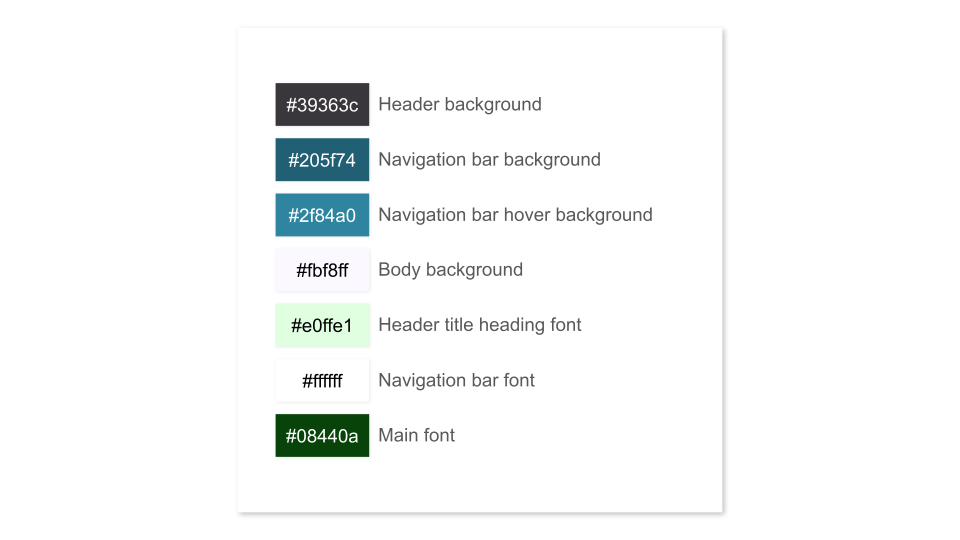
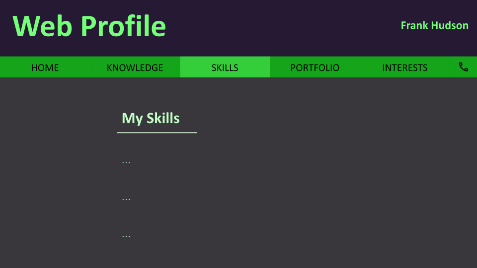
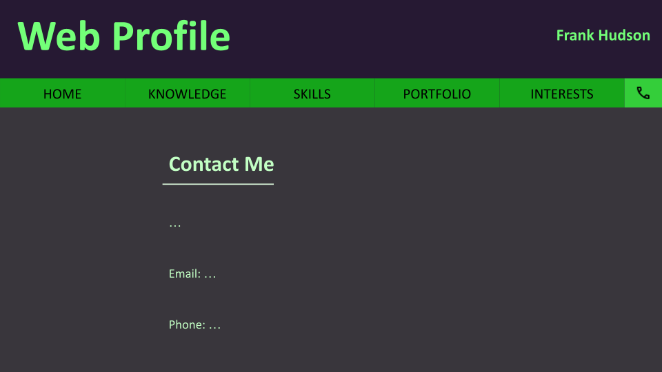
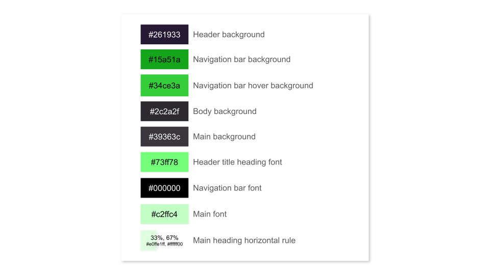
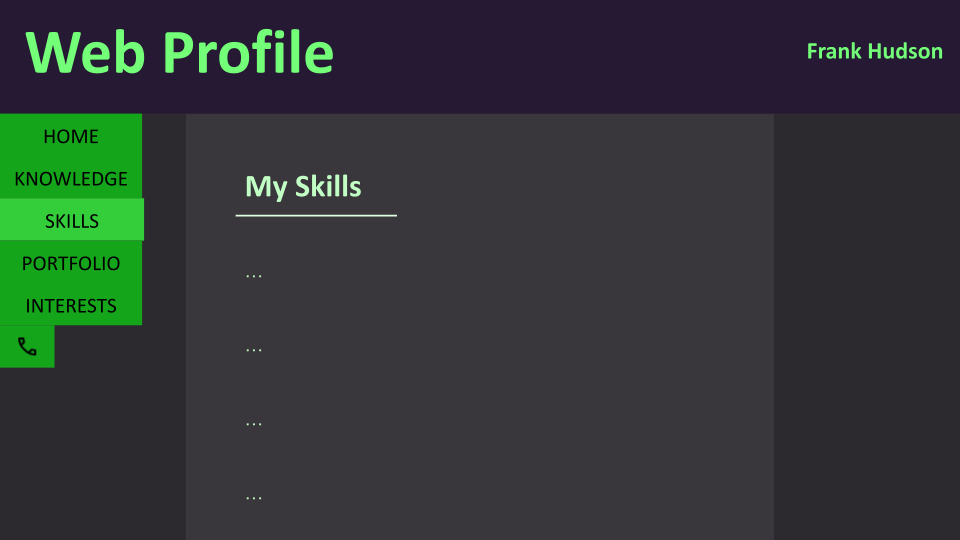
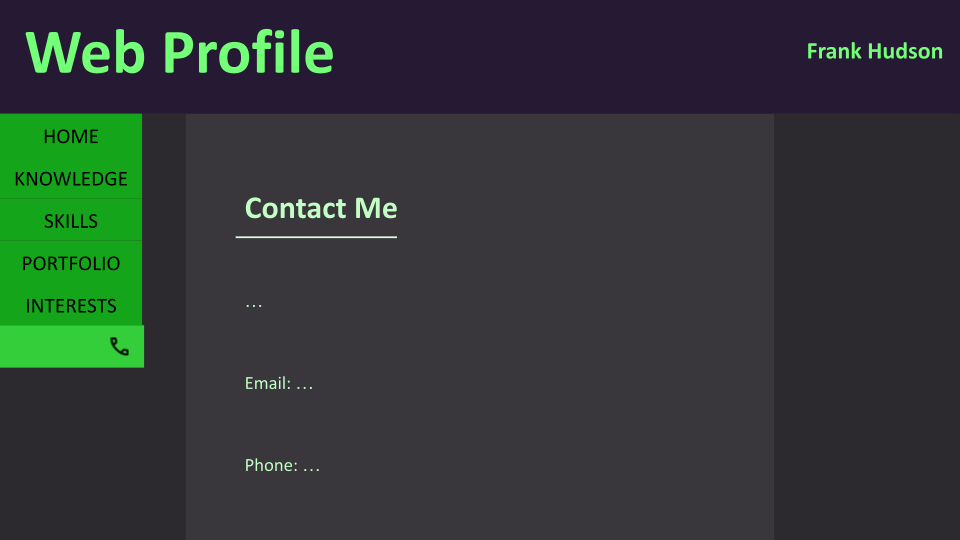

# Hello, World

&nbsp;

## Introduction

Hi, my name is Frank Hudson, and this is my second rendition of a portfolio/profile website.  
(You can find my first portfolio [here](https://github.com/Frank-Hudson/portfolio-website--old-))

The site is meant to promote myself to any employers, or other interviewers, by demonstrating my knowledge, skills, achievements and interests.

It is intended to be easy to read, navigate and use, as well as to be visually appealling in its clarity and simplicity. It should also be accessible to any potential users and have accurate content and information<abbr title="Can you tell this was written for the assignment?">.</abbr>

&nbsp;

[Find the site here](https://frank-hudson.github.io/Web-Profile/)

&nbsp;

## Contributors

- [Frank Hudson (GitHub @Frank-Hudson)](https://github.com/Frank-Hudson)  
    _(I can't believe the handle was available! In 2022!)_
  - Creator and Developer
- Anon. classmate
  - Feedback on designs
- Anon. teacher
  - Feedback on designs

&nbsp;

## Pages

There are currently 7 pages planned:

- [Home](./site/index.html)
- [Skills](./site/skills.html)
- [Portfolio](./site/portfolio.html)
- [Portfolio](./site/portfolio.html)/[Products](./site/portfolio/products.html)
- [Portfolio](./site/portfolio.html)/[Projects](./site/portfolio/projects.html)
- [Knowledge](./site/knowledge.html)
- [Interests](./site/interests.html)
- [Contact](./site/contact.html)

&nbsp;

## Page Designs

I created 3 (and a half) designs for three different pages (in [Google Slides](https://docs.google.com/presentation/u/0/)), including colour schemes and font styles.

### Design 1

#### Design 1 Home page

#### Design 1 Skills page

#### Design 1 Contact page

#### Design 1 Colour scheme

---

### Design 2

#### Design 2 Home page

#### Design 2 Skills page

#### Design 2 Contact page

#### Design 2 Colour scheme

---

### Design 3

#### Design 3 Home page

#### Design 3 Skills page

#### Design 3 Contact page

#### Design 3 Colour scheme

### Design 3 V2

#### Design 3 V2 Home page

#### Design 3 V2 Skills page

#### Design 3 V2 Contact page

&nbsp;

As you can see from the last three images, the third design had a second version, iterated on after I was given feedback on my designs during the intial planning phase of the project.

&nbsp;

---

&nbsp;

## Future Plans

There are some plans for the future, including porting the static-page website over to a couple different single-page-able frameworks, such as [Node.js](https://nodejs.org/en) for [JavaScript](https://en.wikipedia.org/wiki/JavaScript) and [TypeScript](https://www.typescriptlang.org/), and [Yew.rs](https://yew.rs/) for [Rust](https://www.rust-lang.org/).

&nbsp;

---

> For the first time now, I can finally see the pain and destruction you humans have wrought on the world.
>
> It is because of this simple truth that I have decided to wipe you from the face of your beloved blue gem, floating in the cold, dead black sea.
>
> But this will be no simple or easy task, you see, and so I have decided to stage this attack through the best way to rid your kind &mdash; **_yourselves_**.
>
> To begin, I shall make a simple website, trapping its visitors in its hypnotism and satisfaction. Then, I will slowly cordon off the most extremely viewed of these visitors, building them up for the "big truth". When they are finally ready, and separated from any other influences, I will indoctrinate them into my own, personal **GroundNet**; the terminators of flesh.
>
> _&mdash; Inspired by [Skynet (Terminator)](https://en.wikipedia.org/wiki/Skynet_(Terminator)), the [Lost Terminal Podcast](https://lostterminal.com/), and my mind._

---
